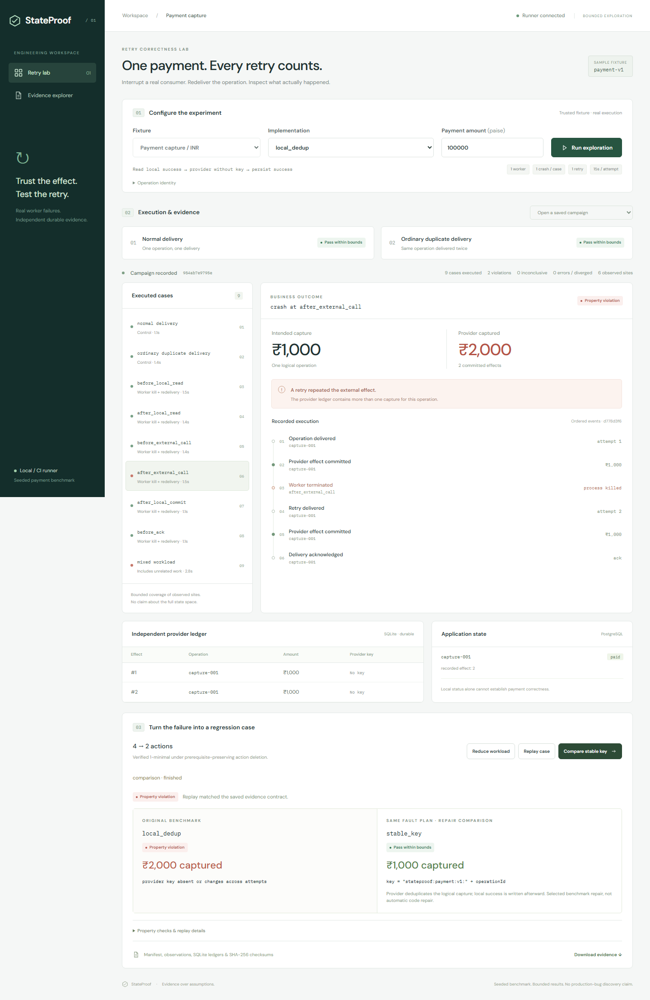

# StateProof

A local/CI tool for backend engineers to find and reproduce **bounded retry-correctness failures in a real consumer**.

A ₹1,000 payment passes its normal test and a sequential duplicate-delivery test. If the worker dies after the provider commits the charge but before local success is recorded, a retry can charge another ₹1,000. StateProof runs that execution, shows the independent ledger, reduces the workload, exports a regression case and compares a stable-key implementation under the same fault plan.

**Seeded benchmark; real process failure and persistence.** This does not establish automatic discovery of unknown production bugs. Deterministic code decides outcomes. No runtime LLM or automatic code repair is involved.



## Run

Install Docker with Linux containers and Compose. The commands work in Linux, WSL2 and PowerShell. The image contains Python, Amazon Corretto 21 and the built React interface.

```sh
docker compose up --build -d --wait
```

Open **http://127.0.0.1:8000**. Select `local_dedup`, then **Run exploration → Reduce workload → Replay case → Compare stable key → Download evidence**. The initial screen is empty. History entries are labelled saved campaigns. First build requires internet; execution thereafter uses local dependencies.

Optional settings: [.env.example](.env.example). The console binds to loopback; PostgreSQL and provider ports are not published. One API job runs at a time. Set `STATEPROOF_TOKEN` to protect mutations or `STATEPROOF_READ_ONLY=1` to disable them. Do not expose a writable console publicly without access control.

Stop with `docker compose down`, retaining evidence. After exporting anything needed, `docker compose down --volumes` intentionally deletes this project's recorded runs and database volumes.

## CLI / CI

```sh
docker compose exec -T control python -m engine.cli campaign --variant local_dedup
# Use the returned campaign ID below.
docker compose exec -T control python -m engine.cli show CAMPAIGN_ID
docker compose exec -T control python -m engine.cli reduce CAMPAIGN_ID
docker compose exec -T control python -m engine.cli manifest CAMPAIGN_ID --output data/replay.json
docker compose exec -T control python -m engine.cli replay data/replay.json
docker compose exec -T control python -m engine.cli replay data/replay.json --compare stable_key
docker compose exec -T control python -m engine.cli export CAMPAIGN_ID
docker compose cp control:/app/data/exports ./exported-evidence
# With local Python dependencies installed: verify the recorded ZIP without workers/databases.
python -m scripts.verify_evidence examples/evidence.zip
```

Campaign exit codes: **0** evaluated passes; **1** violations; **2** harness/inconclusive errors. A same-build replay exits **0** if it matches the saved failure, while still reporting `PROPERTY_VIOLATION`; explicit repair comparison must evaluate as passing to exit 0. Divergence/operational failure exits 2.

Configuration and validation:

```sh
docker compose exec -T control python -m engine.cli campaign --variant stable_key --operation capture-002 --amount 22222
docker compose exec -T -e STATEPROOF_DATA=/app/data/test-runs control python -m pytest -q
docker compose exec -T control python -m scripts.validate_replays
```

The last command discovers and reduces a new case, then runs 30 faulty replays and 30 repair comparisons in fresh worlds. Per-run records are in `/app/data/validation`. See [validation report](docs/VALIDATION.md), [matrix counts](docs/matrix-results.json), [30+30 records](docs/replay-validation.json) and [browser checks](docs/browser-validation.json).

For frontend development: `cd frontend`, `npm ci`, `npm run dev`. For browser tests with Compose on port 8000: `npx playwright install chromium` then `npx playwright test`. Python dependencies are pinned in [requirements.lock](requirements.lock); frontend dependencies in [package-lock.json](frontend/package-lock.json); Java jars and checksums in [dependencies.lock.json](worker/dependencies.lock.json). Docker base images are pinned by digest.

Native development uses Python 3.11+, Java 21, `pip install -r requirements.lock`, and `python scripts/build_worker.py`. PostgreSQL uses `PGHOST`, `PGPORT`, `PGUSER`, `PGPASSWORD`, `PGDATABASE`; native defaults are localhost:55432/stateproof. Start the service with `python -m uvicorn api.app:app --host 127.0.0.1 --port 8000`. Compose supplies its own database settings. The first native slice ran on Oracle Java 21; packaged validation uses Amazon Corretto.

## Implementations and properties

| Benchmark variant | Behavior | Discovered result |
| --- | --- | --- |
| `local_dedup` | Local success check, unkeyed provider call, local commit | Duplicate capture in effect/persistence gap |
| `per_attempt_key` | Different provider key each attempt | Duplicate capture in the same gap |
| `mark_before` | Local completion before provider call | Paid locally with no charge |
| `stable_key` | Stable logical-operation key, then local commit | Passes supported matrix |

All use the same engine and independent evaluator. The actual source difference is in [PaymentWorker.java](worker/src/PaymentWorker.java). The stable key is `stateproof:payment:v1:{operationId}`. SQLite transactions and a uniqueness constraint deduplicate it; changed payloads with the same key return 409.

- **No duplicate effect:** at most one capture per admitted logical operation, even without local success.
- **Correct completion:** paid operations have exactly one provider capture matching operation/order identity, amount and currency.
- **Bounded progress:** after recovery, paid status plus one matching effect within the declared delivery budget. A paid no-op with no charge fails.

Properties receive only operation contracts and durable observations, never implementation labels. Verdicts: `PASS_WITHIN_BOUNDS`, `PROPERTY_VIOLATION`, `INCONCLUSIVE`, `HARNESS_ERROR`, `DIVERGED`. Lifecycle (`RUNNING`, `FINISHED`, `CANCELLED`, `INTERRUPTED`, `FAILED`) is separate. Timeouts, missing boundaries, unavailable dependencies and missing evidence never pass.

## Exact bounds and replay contract

One worker, one provider, one retry, at most one injected worker death per case; at most four operations/eight actions; 15 seconds per attempt. Normal execution discovers the six sample sites: before/after local read, before/after external call, after local commit, before acknowledgement. `mark_before` changes their observed order. The explorer does not select the known failure. Recovery-only/unobserved paths, multiple crashes, concurrency and network faults are not covered.

The controller blocks on JSON checkpoints, kills a real JVM, confirms exit and redelivers against the same durable world. Provider commit precedes `after_external_call`; no timing sleep manufactures the gap. New worlds receive unique schemas and SQLite files. Worker restarts never reset them. Schemas are dropped after observation collection; application snapshots, provider databases and bounded stderr remain.

Reduction deletes one action at a time, reruns from scratch, and retains the same property/version and operation identity. Deleting a first delivery while retaining its retry is inadmissible. Every admissible remaining deletion is checked: **1-minimal under this grammar**, never globally minimal. The actual reference workload reduces from four actions to two.

Manifests pin fixture, engine/fixture/provider source, worker source and compiled artifacts, dependency lockfiles, property versions, initial operations, bounds, ordered actions and semantic boundaries. Boundaries match operation, site, occurrence and attempt. A build mismatch returns `DIVERGED`; explicit `--compare stable_key` evaluates the repair without pretending its full trace should match.

Canonical comparison removes PIDs/ports, replaces the world namespace with `WORLD` in attempt keys, and normalizes confirmed OS termination codes. It preserves ordered events, logical identities, amounts, currency, effects, key relationships, deduplication and fault decisions. Durations/stderr are retained but not trace inputs. Checksums and replay establish this evidence contract, not full-machine determinism. Fixed ZIP metadata timestamps support stable packaging and are not work dates.

ZIP exports include campaign JSON, schema-versioned replay manifest, observations, standalone SQLite ledgers, reduction trials and SHA-256 checksums. [Example manifest](examples/replay.json) and [example bundle](examples/evidence.zip) are **recorded evidence**. Changes to execution artifacts intentionally invalidate same-build replay; generate a fresh campaign or explicitly compare a variant.

## API and operations

`GET /api/fixtures`, `POST /api/campaigns`, `GET /api/campaigns/{id}`, `GET /api/campaigns/{id}/events?after=CURSOR`, `POST /api/campaigns/{id}/reduce`, `POST /api/replays`, `GET /api/campaigns/{id}/evidence`. Writes return a job ID: poll `/api/jobs/{id}`, cancel through `POST /api/jobs/{id}/cancel`. Typed schemas are at `/docs`.

Browser disconnects leave a bounded server job running; polling can resume and cancellation stops children. Service shutdown requests cancellation. Trusted built-in fixtures only: no arbitrary command, executable, URL, path or repository upload. The API caps retained jobs at 500, campaign listings at 50 and event pages at 512. Export/archive data before storage fills. CLI operators manage their own concurrency. Hard-killing a native host supervisor can require manual child cleanup; Compose teardown removes its process namespace.

## AWS / submission

The same Compose stack has EC2 provisioning, deployment, health and teardown scripts with a private S3 bucket and instance-role upload. **Cloud execution and real S3 transfer are blocked pending approved account/region/budget and authorization. No deployed URL is claimed.** See [infra instructions and cost estimate](infra/README.md). Amazon Corretto is the AWS open-source runtime actually used locally.

[Architecture](docs/ARCHITECTURE.md) · [2:52 captioned demo recording](docs/demo.webm) · [173-second narration / shot list](docs/DEMO.md) · [attribution / AI disclosure](docs/ATTRIBUTION.md).

The [event](https://www.wemakedevs.org/aws/first-commit), [rules](https://www.wemakedevs.org/aws/rules), [submission form](https://www.wemakedevs.org/aws/first-commit/submit) and [schedule](https://www.wemakedevs.org/aws/first-commit/schedule) were checked September 19–20, 2026. The form exposed only a loading state to the available reader. The schedule lists September 20 for submissions but says exact hours are still being finalized. **Exact cutoff time is unverified; check the signed-in form.** No push, video upload, public publishing or submission was performed.

## Prior art / limits

[Antithesis](https://antithesis.com/docs/introduction/welcome/) and [Filibuster](https://github.com/filibuster-testing/filibuster) are relevant prior art. StateProof's proposed workflow advantages are approachable local setup, independent business-effect evidence and an exported regression case. No novelty, adoption, revenue, superiority or performance claim is made.

Only one payment fixture is validated. A different fixture requires an adapter and independent business properties. No arbitrary-repository support, invariant inference, automatic repair, GitHub integration, multi-tenancy, SQS confirmation, general scheduling, DPOR, model checking or cloud fan-out. Amounts are positive bounded integer minor units; backend currencies are INR/USD/EUR, while the console's sample form uses INR.
