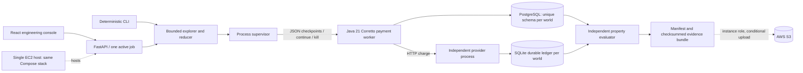

# StateProof architecture

The fixture adapter initializes the schema once. The worker never creates tables or resets data. A controller-triggered worker death leaves the provider process, its ledger and PostgreSQL commits alive. Each delivery starts a new JVM using the same domain handler and durable world state. Separate worlds receive unrelated random schema names and separate SQLite files; observations are retained before the schema is dropped.

Checkpoints are a blocking protocol. A successful provider response follows SQLite commit; after_external_call therefore describes a real committed effect, rather than a timing guess. Java stdout contains JSON only and stderr is retained in a bounded buffer. The supervisor validates identities, imposes deadlines, confirms process exit and cleans up only its own children.

Payment is a seeded benchmark with four implementations. The explorer discovers sites from the normal run and does not know which site fails. mark_before moves its local commit earlier, so its observed site order differs. The evaluator receives only operation contracts and independently collected durable state; variant names never determine verdicts.

Bounds: one consumer, one provider, one injected worker death, at most two deliveries per operation, at most four operations/eight actions, 15 seconds per attempt. No thread scheduling, arbitrary repository execution, network partition coverage, model checking or inferred invariants. A bounded progress failure is a result within this budget, not infinite-time liveness proof.
